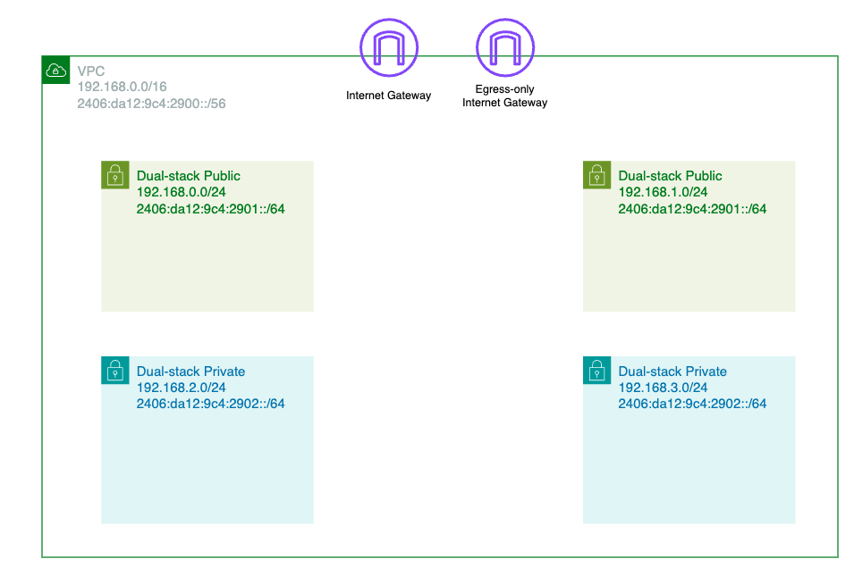

# 개요
* ipv6 EKS



# 준비
* IAM role(실습 편의를 위해 Administrator): EKS auth-configmap에 사용
* IAM role를 설정한 AWS Profile

```sh
vi ~/.aws/config
[default]
region = ap-northeast-2
output = json

[profile eks]
role_arn = arn:aws:iam::xxxxxxxxx:role/xxxxxxxxxx
source_profile = default
```

# 배포 방법

1. 테라폼 환경변수 설정

```sh
export TF_VAR_assume_role_arn="your_IAM_role"
export AWS_PROFILE="your_profile"
```

2. terraform apply

```sh
terraform init
terraform apply
```

3. kubeconfig 생성

```bash
# kubeconfig 생성
aws eks update-kubeconfig --region ap-northeast-2 --name ipv6-eks-createby-terraform

# cluster 확인
kubectl cluster-info
```

# 삭제 방법

```sh
terraform destroy
```

# 참고자료
* [terraform aws eks module](https://github.com/terraform-aws-modules/terraform-aws-vpc/blob/v5.5.2/examples/ipv6-only/main.tf)
* [terraform eks blueprint][https://github.com/aws-ia/terraform-aws-eks-blueprints/tree/main/patterns/ipv6-eks-cluster]
* [aws docs VPC CNI](https://docs.aws.amazon.com/eks/latest/userguide/cni-iam-role.html#cni-iam-role-create-ipv6-policy)
