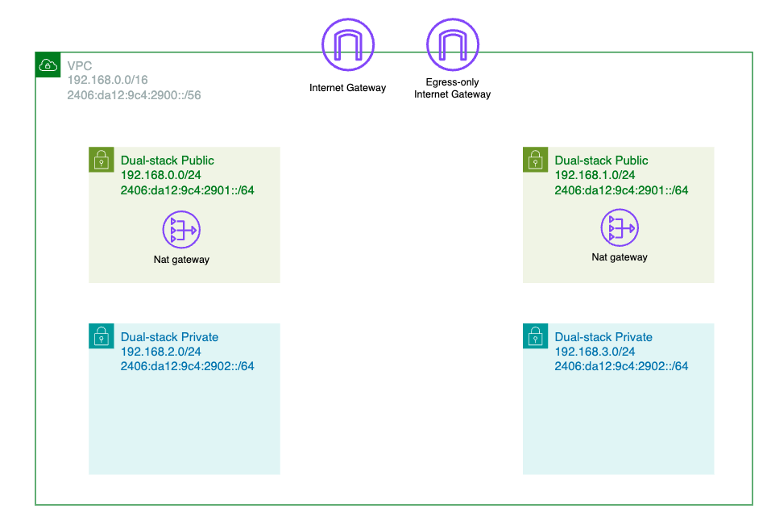

# 개요
* ipv6 EKS



# 준비
* IAM role(실습 편의를 위해 Administrator): EKS auth-configmap에 사용
* IAM role를 설정한 AWS Profile

```sh
vi ~/.aws/config
[default]
region = ap-northeast-2
output = json

[profile eks]
role_arn = arn:aws:iam::xxxxxxxxx:role/xxxxxxxxxx
source_profile = default
```

# 배포 방법

1. 테라폼 환경변수 설정

```sh
export TF_VAR_assume_role_arn="your_IAM_role"
export AWS_PROFILE="your_profile"
```

2. terraform apply

```sh
terraform init
terraform apply
```

# 삭제 방법

```sh
terraform destroy
```
