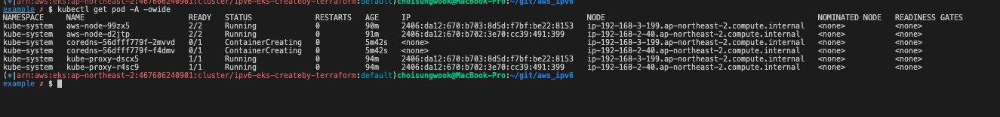
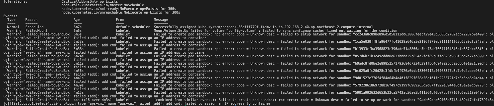
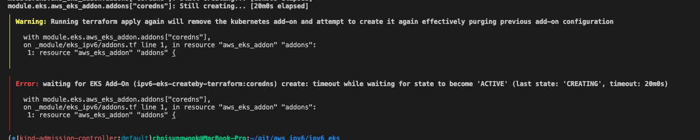
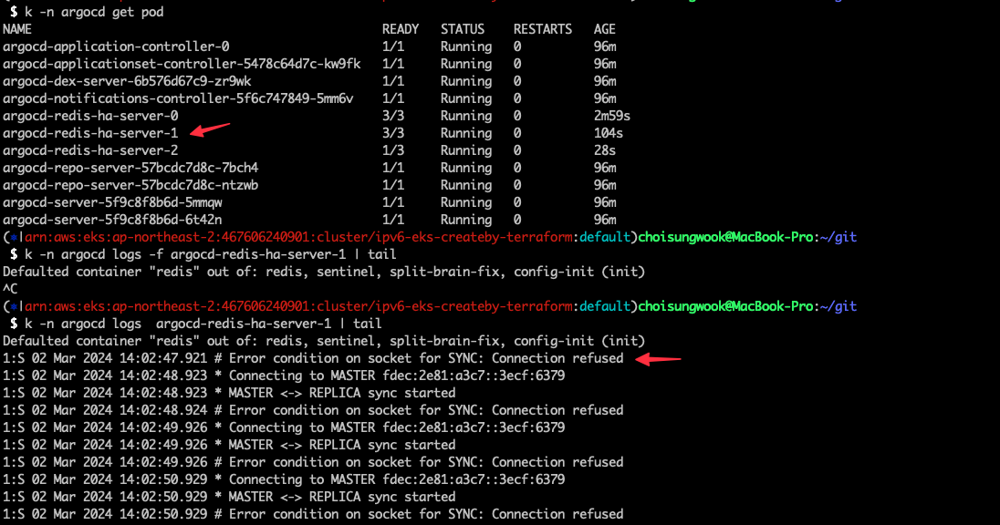

<!-- TOC -->

- [개요](#개요)
- [VPC CNI pod IP 할당 실패](#vpc-cni-pod-ip-할당-실패)
- [ArgoCD Redis HA설정에 IPv6 설정이 안되어 있어 발생하는 장애](#argocd-redis-ha설정에-ipv6-설정이-안되어-있어-발생하는-장애)

<!-- /TOC -->

# 개요
* 트러블 슈팅 기록

# VPC CNI pod IP 할당 실패

# ArgoCD Redis HA설정에 IPv6 설정이 안되어 있어 발생하는 장애

> 참고자료: https://github.com/argoproj/argo-cd/issues/11388#issuecomment-1603431410

> 참고자료: https://github.com/argoproj/argo-helm/issues/1111

> 참고자료: https://github.com/DandyDeveloper/charts/pull/186

